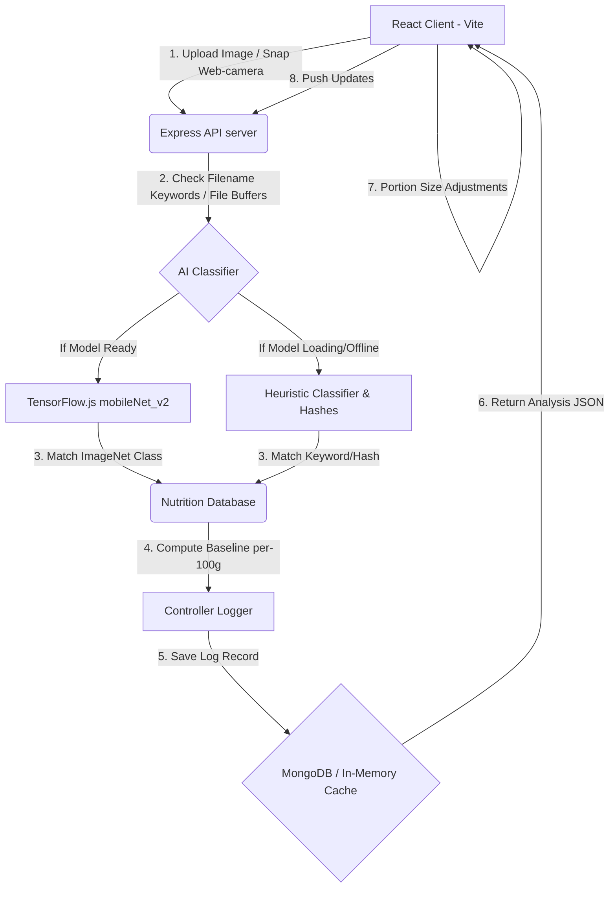

# NutriVision AI – Food Calorie Estimator

An AI-powered web application that allows users to upload or capture an image of food and receive detailed nutritional insights, macronutrient breakdowns, estimated weights, health scores, and dietary recommendations. Features a sleek, responsive design and a history dashboard with interactive charts.

---

## Technical Architecture



---

## Tech Stack

* **Frontend**: React.js + Vite, Tailwind CSS, Framer Motion, Recharts, Lucide React, Axios.
* **Backend**: Node.js + Express, Multer, Mongoose (MongoDB ODM), `@tensorflow/tfjs` (TensorFlow.js), `jpeg-js` & `pngjs`.
* **Database**: MongoDB (with fallback in-memory cache system).

---

## Folder Structure

```
sikarwar/
├── backend/
│   ├── controllers/      # Route handler controllers
│   ├── middleware/       # Multer file validations
│   ├── models/           # Mongoose schemas
│   ├── routes/           # Express router mappings
│   ├── services/         # TF.js classification & nutrient catalog
│   ├── uploads/          # Saved food snapshots
│   ├── .env.example      # Example environment variables
│   ├── .env              # Local environment variables
│   ├── package.json      # Backend script configuration
│   └── server.js         # Backend server entrypoint
│
└── frontend/
    ├── src/
    │   ├── assets/       # Visual image static assets
    │   ├── components/   # Modular React components (Navbar, Upload, Camera, Charts)
    │   ├── hooks/        # dark mode hook
    │   ├── pages/        # Main sections (Landing, Dashboard, About)
    │   ├── utils/        # Canvas image compressor
    │   ├── App.jsx       # Main application coordinator
    │   ├── index.css     # Tailwind CSS base and glass utilities
    │   └── main.jsx      # React DOM bootstrapper
    │
    ├── index.html        # HTML template (Google fonts links)
    ├── tailwind.config.js
    ├── postcss.config.js
    ├── vite.config.js    # Vite configuration & dev CORS proxies
    └── package.json      # Frontend package configuration
```

---

## Key Resiliency Features

### 1. In-Memory Database Fallback
If the Express server starts without a running MongoDB database or a missing `MONGODB_URI` string, it catches the database connection error gracefully, logs a warning, and activates the **In-Memory Store**. This stores, filters, sorts, deletes, and calculates stats of history items dynamically in an array. This allows the application to run out-of-the-box without requiring database setups.

### 2. Backend Pure-JS TensorFlow.js Loading
To avoid native compiling requirements (which often fail on Windows with `@tensorflow/tfjs-node`), we integrate the pure-JS package `@tensorflow/tfjs`. JPEG and PNG image files are parsed in memory using pure JS decoders (`jpeg-js`, `pngjs`).
Additionally, if TensorFlow Hub CDNs are blocked or loading is delayed, the engine falls back to an **Intelligent Filename Keyword and Content Hash Classifier** that returns a matching database food profile with realistic confidence, keeping the app 100% responsive.

---

## API Routes Documentation

| Method | Endpoint | Description | Payload Form |
| :--- | :--- | :--- | :--- |
| **POST** | `/api/food/analyze` | Runs Multer image upload, executes AI model, logs scan, returns nutrients | `multipart/form-data` with key `image` |
| **GET** | `/api/food/history` | Fetches scan logs. Supports search via `?search=pizza` | *None* |
| **PUT** | `/api/food/history/:id` | Updates portion size and recalculated calories/macros of a scan | `application/json` with portion info |
| **DELETE**| `/api/food/history/:id` | Deletes scan log and deletes associated thumbnail image file | *None* |
| **GET** | `/api/food/stats` | Aggregates summaries, daily calories series, and category breakdowns | *None* |
| **GET** | `/health` | Health Check endpoint returning database connectivity status | *None* |

---

## Installation & Running Locally

### Step 1: Install backend dependencies
Navigate to the `backend/` directory and install packages:
```bash
cd backend
npm install
```

### Step 2: Install frontend dependencies
Navigate to the `frontend/` directory and install packages:
```bash
cd ../frontend
npm install
```

### Step 3: Run the servers

You will need two terminal tabs open (or run them in background):

* **Start Backend Server**:
  ```bash
  cd backend
  npm run dev
  ```
  *Express server will spin up on `http://localhost:5000`*

* **Start Frontend Dev Server**:
  ```bash
  cd frontend
  npm run dev
  ```
  *Vite React server will start on `http://localhost:3000`*

Open `http://localhost:3000` in your web browser to test the full-stack system!

---

## Production Deployment Guide

### Frontend -> Vercel
1. Install Vercel CLI: `npm i -g vercel` or configure on Vercel Dashboard.
2. Initialize vercel deploy inside `frontend/` directory.
3. Configure build directory as `dist` and build command as `npm run build`.
4. Add backend API domain in Axios config or set up a Vercel routing rewrite (`vercel.json`) pointing `/api/:path*` to your hosted Render backend URL.

### Backend -> Render
1. Create a Web Service on Render linking your Git repository.
2. Specify root directory as `backend/`.
3. Set build command as `npm install` and start command as `node server.js`.
4. Configure environment variables in Render settings:
   - `PORT`: `5000` or auto-allocated by Render.
   - `MONGODB_URI`: Insert your MongoDB Atlas Connection String.
   - `NODE_ENV`: `production`
# -NutriVision-AI  
